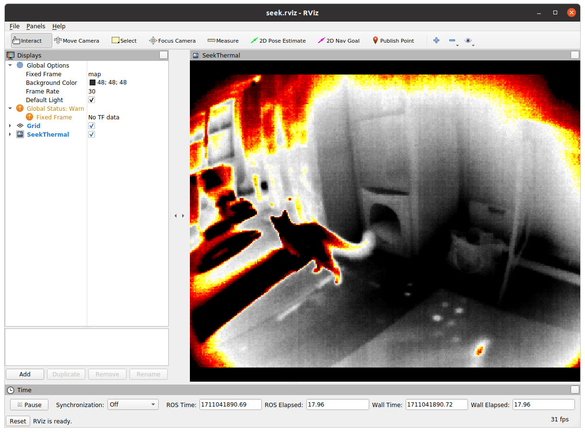

# seek-thermal

ROS wrapper for the Seek Mosaic starter kit thermal camera. Built on the Seek SDK v4.3. Uses the Seek API to get frames, OpenCV to read data, and republishes as ROS image topic.

## Setup
[Download](https://developer.thermal.com/support/solutions/articles/48001240854-seek-thermal-sdk-v4-3) and install SDK:
```
sudo apt-get install libsdl2-dev
unzip <SDK>
cd <SDK>
cd <your_architecture>
<SDK/arch>$ sudo cp lib/libseekcamera.so /usr/local/lib
<SDK/arch>$ sudo cp lib/libseekcamera.so.4.3 /usr/local/lib
<SDK/arch>$ sudo cp -r include/* /usr/local/include
<SDK/arch>$ sudo cp driver/udev/10-seekthermal.rules /etc/udev/rules.d
<SDK/arch>$ sudo udevadm control --reload
<SDK/arch>$ sudo chmod u+x bin/*
```

Clone and build. Tested with ROS noetic.
```
mkdir -p catkin_ws/src
cd catkin_ws/src
git clone git@github.com:robotics-88/seek-thermal.git
cd ..
rosdep install --from-paths src --ignore-src -r -y
catkin build
```

## Usage

With device plugged in by USB, run:
```
roslaunch seek_thermal_88 seek.launch
```
If successful, the Rviz window that pops up should look like this:



## TODO

* Sometimes the camera device does not connect properly at the start (maybe 25% of the time), so the ROS node is set to crash and respawn in that case. Not ideal but a temporary workaround until we can get it to programmatically reconnect the device.

* Publishing at a lower rate, about 18 fps. Why?